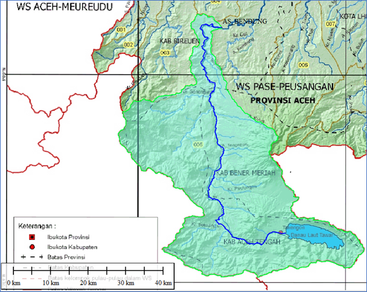
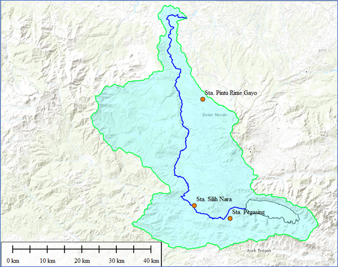

```{r setup, include=FALSE}
library(ggplot2)
library(readr)
library(knitr)
knitr::opts_chunk$set(echo = FALSE,message = FALSE,dpi = 300, fig.align="center")
knitr::read_chunk('visualize-and-grouping-data.R')
```

```{r, nama-lokasi-proyek, echo=FALSE}
# nama-nama unik pada proyek yang dibuat
subdas <- "Bendung Panthe Long"
jumlah_pos <- 3
jumlah_pos_text <- "tiga"
Sta_1 <- "Stasiun Hujan Pegasing"
Sta_2 <- "Stasiun Hujan Pintu Rime Gayo"
Sta_3 <- "Stasiun Hujan Silih Nara"

```

# Sub DAS `r subdas`

Untuk dapat menghitung debit banjir dan debit andalan, diperlukan 2 (dua) inputan data utama. Input yang pertama adalah karakteristik dari sub DAS yang ditinjau seperti luasan, panjang sungai, dan kemiringan sungai. Kemudian input kedua yang diperlukan adalah curah hujan rencana.

Untuk data karakteristik sub DAS diperoleh dari deliniasi peta rupa bumi Indonesia (RBI) dan peta Wilayah Sungai dari Permen PUPR No. 4 Tahun 2015 Tentang Kriteria dan Pembagian Wilayah Sungai. Hasil deliniasi untuk lokasi yang ditinjau ditampilkan pada Gambar \@ref(fig:subdas-all)

(ref:subdas) Lokasi Sub DAS `r subdas`

```{r subdas-all, fig.cap="(ref:subdas)",fig.align="center"}
library(knitr)


```

# Data Hujan

Data hujan yang digunakan bersumber dari BMKG. Di sekitar area sub DAS terdapat `r jumlah_pos` (`r jumlah_pos_text`) stasiun hujan yang terdekat. Yaitu `r Sta_1`, `r Sta_2` dan `r Sta_3`. Berikut ditampilkan posisi stasiun hujan terhadap sub DAS (Gambar \@ref(fig:lokasi-pos)) serta tabel data hujan pada masing-masing stasiun tersebut.

```{r lokasi-pos, fig.cap="Posisi Stasiun Hujan Terhadap Sub DAS",fig.align="center"}
library(knitr)


```

Lihat Gambar \@ref(fig:plot-gabung) dan Gambar \@ref(fig:plot-pisah).

(ref:data-hujan) Overlay Plotting Data Hujan Terdekat di Sub DAS `r subdas`

(ref:data-hujan-pisah) Overlay Plotting Data Hujan Pada Masing-masing Pos Hujan Terdekat di Sub DAS `r subdas`

(ref:hujan-max-sta1) Rekapitulasi Curah Hujan Harian Maksimum `r Sta_1`

```{r, data-hujan, include=FALSE}
```

```{r, plot-gabung, echo=FALSE, fig.cap="(ref:data-hujan)"}

```

```{r, plot-pisah, echo=FALSE, fig.cap="(ref:data-hujan-pisah)"}
```

```{r, CurahHujan_sta1, message=FALSE, warning=FALSE, caption="(ref:hujan-max-sta1)", echo=FALSE}

```

# Pemeriksaan Data Curah Hujan

## Pemeriksaan Outlier

## Uji Konsistensi

# Curah Hujan Wilayah

# Debit Banjir

## Bagan Alir Perhitungan Debit Banjir Rencana

## Analisa Frekuensi

## Uji Pemilihan Distribusi Frekuensi

## Distribusi Hujan

## Koefisien Pengaliran

## Hasil Perhitungan Debit Banjir

# Debit Andalan

## Evapotranspirasi

## Model FJ. Mock

# Kebutuhan Air Irigasi

## Penggantian Lapisan Air (Water Layer Replacement)

## Perkolasi (P)

## Curah hujan efektif (Re)

## Evapotranspirasi Acuan (ETo)

## Evapotranspirasi Konsumtif (ETc)

## Efisiensi Irigasi

## Kebutuhan Air Tanaman

## Pola Tanam

## Kebutuhan Air pada Bangunan Pengambilan (Intake)

# Kesimpulan
